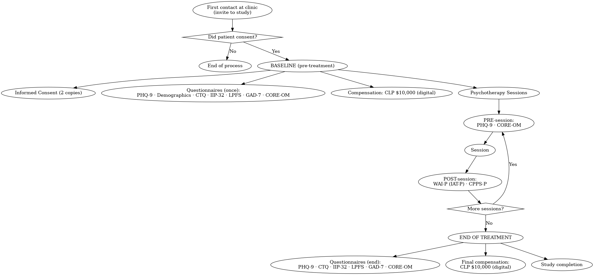
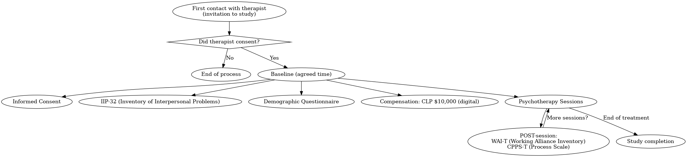

```{r setup, include=FALSE}
knitr::opts_chunk$set(echo = FALSE, warning = FALSE, message = FALSE, fig.width = 10, fig.height = 6)
```

# NODAL Dataset Analysis

This document provides an interactive analysis of the NODAL dataset, focusing on core data patterns and structure. The NODAL dataset is a comprehensive collection of data points from a set of clinical studies:

(1) __"Towards a comprehensive model of the therapeutic alliance in psychotherapy with depressed patients: understanding the relationship between the alliance, patient/therapist characteristics, process variables, and outcome"__ funded by project FONDECYT 1191299 from the "Agencia Nacional de Investigación y Desarrollo" (ANID) [2019-2024].

(2) __"Trauma informed psychotherapy for patients with depressive symptomatology and history of ELMA"__, funded by Fondo de Investigación Prioritaria (FIP), MIDAP [2024].

(3) Project __"Retroalimentación en Psicoterapia"__ code 241209010, funded by Fundación PsiConecta [2025].

## About FONDECYT 1191299

<details>
<summary><strong>Click to expand</strong></summary>

<br/>

### Theoretical Summary

The Therapeutic Alliance has been defined as the __agreement between patient and therapist__ regarding tasks, goals, and the quality of the emotional bond (Bordin, 1979). We know that the concept of therapeutic alliance is __positively related to a wide range of positive psychotherapy outcomes__ such as symptom reduction, improvements in interpersonal functioning, and better achievement of therapeutic goals (Constantino, Castonguay, & Schut, 2002; Constantino, Castonguay, Zack, DeGeorge, 2010). Additionally, the therapeutic alliance in the early stages of treatment has been found to significantly predict changes in depressive symptoms (Klein et al., 2003).

Research has also shown that __patient characteristics contribute to the quality of the therapeutic alliance__ (Flückiger, Del Re, Wampold, & Horvath, 2018). Patients with higher scores in interpersonal functioning report a stronger alliance at the start of treatment (Hersoug, Hoglend, Havik, von der Lippe, & Monsen, 2009a). Thus, good quality in past and present relationships appears to be favorable for the establishment of the therapeutic alliance. In turn, the severity of patients’ baseline symptoms is predictive of the pattern of change in the early alliance: with greater severity, there is a higher likelihood of unresolved ruptures (Zilcha-Mano & Errázuriz, 2017), and patients with adverse early experiences are more prone to show avoidance and hold negative beliefs about others (Safran, Crocker, McMain, & Murray, 1990), making the establishment of a therapeutic alliance more challenging.

According to a meta-analysis of the total variance in psychotherapy outcomes, 8% can be explained by the __contribution of the theoretical model__ (Wampold, 2001). It seems that aspects related to technique, such as expertise, listening, and the therapist’s active engagement, contribute to the development of the alliance according to patients’ perceptions (Altimir, Capella, Núñez, Abarzúa, & Krause, 2017).

The FONDECYT study (N1191299), led by Professor Paula Errázuriz with co-investigators Alex Behn, Candice Fischer, and Mariane Krause, is titled:
__“Comprehensive model of the therapeutic alliance in psychotherapy with patients with depression: understanding the relationship between alliance, patient/therapist characteristics, process variables, and outcomes.”__

In broad terms, the study aims to “propose an empirically comprehensive model of the therapeutic alliance in the treatment of patients with depression, considering the relationship between patient and therapist characteristics, process variables, and psychotherapy outcomes.”

### Specific Objectives of the Study

- Describe the relationship between __patient characteristics__ and the measure of the alliance, trajectory, and ruptures.

- Describe the relationship between __therapist characteristics__ and the measure of the alliance, trajectory, and ruptures.

- Describe the relationship between the __trajectory of the alliance and symptomatic progress__.

- Describe the relationship between the __trajectory of the alliance and psychotherapeutic techniques__.

- Describe the relationship between the __alliance and session frequency__.

- Describe the relationship between the __trajectory of the alliance and outcomes__.

- Test a __predictive model__ that considers patient and therapist characteristics as predictors of the alliance, and the alliance as a predictor of psychotherapy outcomes (change in depression, changes in psychological functioning, treatment termination status).

Based on the integration of results, propose a comprehensive model of the therapeutic alliance for the treatment of depression.

### Specific Hypotheses of the Study

- __Patient and therapist characteristics will significantly predict__ the therapeutic alliance (e.g., patients with fewer baseline symptoms will show greater improvements in the alliance).

- The __trajectory__ of the alliance and __symptomatic progress__ will mutually influence each other.

- Specific __techniques will be associated with a better alliance__. The impact of specific techniques on the alliance will depend on the treatment phase.

- The alliance will be perceived as __stronger by patients treated once per week compared to those treated less frequently__. Furthermore, the association between alliance and outcomes will be stronger in patients with higher treatment frequency.

- __Patients who report a better alliance will have better outcomes__ (e.g., greater reduction in depressive symptoms, less psychological dysfunction, and lower therapy dropout rates).

- In the integrated model, __patient and therapist characteristics will significantly predict the alliance__. The alliance will be a significant predictor of treatment outcomes and a significant mediator between some pre-treatment characteristics and outcomes.


### Study Design

#### Patients procedure

<p style="text-align:center">
  <a href="img/patient_flow_graph.png" target="_blank">
    
  </a>
  <br/>
  <small>Click image to open full-size in a new tab</small>
  
</p>


Patients are invited to participate at their first contact with the clinical institution. Participation requires __informed consent__. If consent is not provided, the process ends. If consent is granted, baseline assessments are collected before the first psychotherapy session, session-by-session measures are gathered throughout treatment, and end-of-treatment measures are administered at termination. Participants receive CLP $10,000 (digital gift card) after the initial assessments and CLP $10,000 again after completing end-of-treatment questionnaires.

##### __Phase 1 — First Contact / Baseline (before the 1st psychotherapy session)__

1. Informed consent (two copies; one for participant, one retained by research team; Ethics approved).

2. Baseline assessments (administered once unless noted):

- __PHQ-9__ (Patient Health Questionnaire-9; depressive symptoms; severity bands: 1–4 minimal, 5–9 mild, 10–14 moderate, 15–19 moderately severe, 20–27 severe).

- __Demographic questionnaire__ (gender, age, education, SES, ethnicity, therapy history, etc.).

- __CTQ__ (Childhood Trauma Questionnaire; Emotional/Physical/Sexual Abuse, Emotional/Physical Neglect).

- __IIP-32__ (Inventory of Interpersonal Problems; interpersonal difficulties / personality disorder screening).

- __LPFS__ (Levels of Personality Functioning Scale).

- __GAD-7__ (Generalized Anxiety Disorder-7).

- __CORE-OM__ (34 items; 0–4 scale; higher = more problems; cut-off ≈ 10; subscales: well-being, problems/symptoms, functioning, risk).

- __MINI__ (selected modules) administered once at intake by a trained psych professional (Major Depressive Episode, Dysthymia, (Hypo)Mania to rule out bipolar).

- Initial __compensation__: CLP $10,000 digital gift card upon completing consent + baseline interview/questionnaires.

##### __Phase 2 — Session-by-Session Tracking__
Before each session:

- __PHQ-9__

- __CORE-OM__

After each session:

- __WAI-P / IAT-P__ (Working Alliance Inventory – patient version; 12 items; therapeutic alliance for the dyad).

- __CPPS-P__ (Comparative Psychotherapy Process Scale – patient version; 20 items; adherence to CBT and interpersonal/psychoanalytic interventions in non-manualized treatments).

#####  __Phase 3 — End of Treatment__

End-of-treatment assessments (administered at last session or shortly after):

- PHQ-9, CTQ, IIP-32, LPFS, GAD-7, CORE-OM.

- Final __compensation__: CLP $10,000 digital gift card after completing end-of-treatment questionnaires.

#### Therapists procedure
<p style="text-align:center">
  <a href="img/therapist_flow_graph.png" target="_blank">
    
  </a>
  <br/>
  <small>Click image to open full-size in a new tab</small>
  
</p>

##### __Phase 1 — First Contact__

- Invitation: Therapist is approached to participate.

- Decision point: If the therapist does not consent → Process ends.

- If the therapist consents, the following instruments are administered (at a time agreed with the therapist):

1. __Informed Consent__

2. __IIP-32__ (Inventory of Interpersonal Problems) — baseline only.

3. __Demographic Questionnaire__ (gender, age, education, SES, therapy background, etc.) — baseline only.

4. __Compensation__: CLP $10,000 (digital gift card via email).

##### __Phase 2 — Session-by-Session Tracking__
After each psychotherapy session, therapists complete:

- __WAI-T__ (Working Alliance Inventory – Therapist version; 12 items; assesses therapeutic alliance for each dyad).

- __CPPS-T__ (Comparative Psychotherapy Process Scale – Therapist version; 20 items; adherence to CBT and interpersonal/psychoanalytic techniques in non-manualized treatment).

## About FIP 2024

</details>


## About study 241209010


```{r libraries}
library(dplyr)
library(ggplot2)
library(lubridate)
library(readr)
library(tidyr)
library(stringr)
library(knitr)
library(kableExtra)
library(DT)
library(plotly)
```

# Data Import and Overview

```{r data-import}
# Load the extracted CSV data with complete metadata chain
cat("📂 Loading FONDECYT item responses data with complete metadata...\n")

# Look for the complete dataset (the only one generated by the updated script)
csv_file <- "data/item_responses_complete_202507271125.csv"

if (!file.exists(csv_file)) {
  stop("❌ Complete dataset not found. Please run the data extraction script:\n",
       "   Rscript data/extract_basic_responses.R\n",
       "This will generate the complete dataset with all metadata.")
}

# Load data
data <- read_csv(csv_file, show_col_types = FALSE)

# Data validation and quality checks - creating a comprehensive validation summary
validation_results <- list()

# Check response_id for numeric conformity
response_id_issues <- data %>%
  filter(!is.na(response_id)) %>%
  mutate(is_numeric = !is.na(as.numeric(as.character(response_id)))) %>%
  filter(!is_numeric)

validation_results$response_id <- list(
  status = ifelse(nrow(response_id_issues) == 0, "✅ PASS", "⚠️ ISSUES"),
  description = "All values are numeric",
  issues_count = nrow(response_id_issues)
)

# Check numeric_value for numeric conformity
numeric_value_issues <- data %>%
  filter(!is.na(numeric_value)) %>%
  mutate(is_numeric = !is.na(as.numeric(as.character(numeric_value)))) %>%
  filter(!is_numeric)

if (nrow(numeric_value_issues) > 0) {
  cat("⚠️  WARNING: Found", nrow(numeric_value_issues), "non-numeric values in numeric_value:\n")
  print(numeric_value_issues %>% select(numeric_value) %>% distinct() %>% head(10))
  cat("   → This may indicate data quality issues that need investigation\n")
} else {
  cat("✅ numeric_value validation: All values are numeric\n")
}

# Check character_value for character conformity
character_value_issues <- data %>%
  filter(!is.na(character_value)) %>%
  mutate(is_character = is.character(character_value) | is.factor(character_value)) %>%
  filter(!is_character)

if (nrow(character_value_issues) > 0) {
  cat("⚠️  WARNING: Found", nrow(character_value_issues), "non-character values in character_value:\n")
  print(character_value_issues %>% select(character_value) %>% distinct() %>% head(10))
  cat("   → This may indicate data quality issues that need investigation\n")
} else {
  cat("✅ character_value validation: All values are character/text\n")
}

# Check administration_id for numeric conformity
administration_id_issues <- data %>%
  filter(!is.na(administration_id)) %>%
  mutate(is_numeric = !is.na(as.numeric(as.character(administration_id)))) %>%
  filter(!is_numeric)

if (nrow(administration_id_issues) > 0) {
  cat("⚠️  WARNING: Found", nrow(administration_id_issues), "non-numeric values in administration_id:\n")
  print(administration_id_issues %>% select(administration_id) %>% distinct() %>% head(10))
  cat("   → This may indicate data quality issues that need investigation\n")
} else {
  cat("✅ administration_id validation: All values are numeric\n")
}

# Check item_id for numeric conformity
item_id_issues <- data %>%
  filter(!is.na(item_id)) %>%
  mutate(is_numeric = !is.na(as.numeric(as.character(item_id)))) %>%
  filter(!is_numeric)

if (nrow(item_id_issues) > 0) {
  cat("⚠️  WARNING: Found", nrow(item_id_issues), "non-numeric values in item_id:\n")
  print(item_id_issues %>% select(item_id) %>% distinct() %>% head(10))
  cat("   → This may indicate data quality issues that need investigation\n")
} else {
  cat("✅ item_id validation: All values are numeric\n")
}

# Check response_time_options for character conformity
response_time_options_issues <- data %>%
  filter(!is.na(response_time_options)) %>%
  mutate(is_character = is.character(response_time_options) | is.factor(response_time_options)) %>%
  filter(!is_character)

if (nrow(response_time_options_issues) > 0) {
  cat("⚠️  WARNING: Found", nrow(response_time_options_issues), "non-character values in response_time_options:\n")
  print(response_time_options_issues %>% select(response_time_options) %>% distinct() %>% head(10))
  cat("   → This may indicate data quality issues that need investigation\n")
} else {
  cat("✅ response_time_options validation: All values are character/text\n")
}

# Check response_date for valid datetime conformity
response_date_issues <- data %>%
  filter(!is.na(response_date)) %>%
  mutate(
    # Try to parse as datetime, catch any that fail
    parsed_date = tryCatch(
      as_datetime(response_date), 
      error = function(e) NA,
      warning = function(w) NA
    ),
    is_valid_datetime = !is.na(parsed_date)
  ) %>%
  filter(!is_valid_datetime)

if (nrow(response_date_issues) > 0) {
  cat("⚠️  WARNING: Found", nrow(response_date_issues), "invalid datetime values in response_date:\n")
  print(response_date_issues %>% select(response_date) %>% distinct() %>% head(10))
  cat("   → This may indicate data quality issues that need investigation\n")
} else {
  cat("✅ response_date validation: All values are valid datetime (POSIXct)\n")
}

# Check session_therapist for numeric conformity
session_therapist_issues <- data %>%
  filter(!is.na(session_therapist)) %>%
  mutate(is_numeric = !is.na(as.numeric(as.character(session_therapist)))) %>%
  filter(!is_numeric)

if (nrow(session_therapist_issues) > 0) {
  cat("⚠️  WARNING: Found", nrow(session_therapist_issues), "non-numeric values in session_therapist:\n")
  print(session_therapist_issues %>% select(session_therapist) %>% distinct() %>% head(10))
  cat("   → This may indicate data quality issues that need investigation\n")
} else {
  cat("✅ session_therapist validation: All values are numeric\n")
}

# Check response_updated for valid datetime conformity
response_updated_issues <- data %>%
  filter(!is.na(response_updated)) %>%
  mutate(
    parsed_date = tryCatch(
      as_datetime(response_updated), 
      error = function(e) NA,
      warning = function(w) NA
    ),
    is_valid_datetime = !is.na(parsed_date)
  ) %>%
  filter(!is_valid_datetime)

if (nrow(response_updated_issues) > 0) {
  cat("⚠️  WARNING: Found", nrow(response_updated_issues), "invalid datetime values in response_updated:\n")
  print(response_updated_issues %>% select(response_updated) %>% distinct() %>% head(10))
  cat("   → This may indicate data quality issues that need investigation\n")
} else {
  cat("✅ response_updated validation: All values are valid datetime (POSIXct)\n")
}

# Check subject_value_id for numeric conformity
subject_value_id_issues <- data %>%
  filter(!is.na(subject_value_id)) %>%
  mutate(is_numeric = !is.na(as.numeric(as.character(subject_value_id)))) %>%
  filter(!is_numeric)

if (nrow(subject_value_id_issues) > 0) {
  cat("⚠️  WARNING: Found", nrow(subject_value_id_issues), "non-numeric values in subject_value_id:\n")
  print(subject_value_id_issues %>% select(subject_value_id) %>% distinct() %>% head(10))
  cat("   → This may indicate data quality issues that need investigation\n")
} else {
  cat("✅ subject_value_id validation: All values are numeric\n")
}

# Check was_skipped for boolean conformity
was_skipped_issues <- data %>%
  filter(!is.na(was_skipped)) %>%
  mutate(is_logical = is.logical(was_skipped) | 
                     (is.character(was_skipped) & tolower(trimws(was_skipped)) %in% c("true", "false", "t", "f", "1", "0")) |
                     (is.numeric(was_skipped) & was_skipped %in% c(0, 1))) %>%
  filter(!is_logical)

if (nrow(was_skipped_issues) > 0) {
  cat("⚠️  WARNING: Found", nrow(was_skipped_issues), "non-boolean values in was_skipped:\n")
  print(was_skipped_issues %>% select(was_skipped) %>% distinct() %>% head(10))
  cat("   → This may indicate data quality issues that need investigation\n")
} else {
  cat("✅ was_skipped validation: All values are boolean/logical\n")
}

# Check item_label for character conformity
item_label_issues <- data %>%
  filter(!is.na(item_label)) %>%
  mutate(is_character = is.character(item_label) | is.factor(item_label)) %>%
  filter(!is_character)

if (nrow(item_label_issues) > 0) {
  cat("⚠️  WARNING: Found", nrow(item_label_issues), "non-character values in item_label:\n")
  print(item_label_issues %>% select(item_label) %>% distinct() %>% head(10))
  cat("   → This may indicate data quality issues that need investigation\n")
} else {
  cat("✅ item_label validation: All values are character/text\n")
}

# Check item_text for character conformity
item_text_issues <- data %>%
  filter(!is.na(item_text)) %>%
  mutate(is_character = is.character(item_text) | is.factor(item_text)) %>%
  filter(!is_character)

if (nrow(item_text_issues) > 0) {
  cat("⚠️  WARNING: Found", nrow(item_text_issues), "non-character values in item_text:\n")
  print(item_text_issues %>% select(item_text) %>% distinct() %>% head(10))
  cat("   → This may indicate data quality issues that need investigation\n")
} else {
  cat("✅ item_text validation: All values are character/text\n")
}

# Check item_measure_id for numeric conformity
item_measure_id_issues <- data %>%
  filter(!is.na(item_measure_id)) %>%
  mutate(is_numeric = !is.na(as.numeric(as.character(item_measure_id)))) %>%
  filter(!is_numeric)

if (nrow(item_measure_id_issues) > 0) {
  cat("⚠️  WARNING: Found", nrow(item_measure_id_issues), "non-numeric values in item_measure_id:\n")
  print(item_measure_id_issues %>% select(item_measure_id) %>% distinct() %>% head(10))
  cat("   → This may indicate data quality issues that need investigation\n")
} else {
  cat("✅ item_measure_id validation: All values are numeric\n")
}

# Check item_is_required for boolean conformity
item_is_required_issues <- data %>%
  filter(!is.na(item_is_required)) %>%
  mutate(is_logical = is.logical(item_is_required) | 
                     (is.character(item_is_required) & tolower(trimws(item_is_required)) %in% c("true", "false", "t", "f", "1", "0")) |
                     (is.numeric(item_is_required) & item_is_required %in% c(0, 1))) %>%
  filter(!is_logical)

if (nrow(item_is_required_issues) > 0) {
  cat("⚠️  WARNING: Found", nrow(item_is_required_issues), "non-boolean values in item_is_required:\n")
  print(item_is_required_issues %>% select(item_is_required) %>% distinct() %>% head(10))
  cat("   → This may indicate data quality issues that need investigation\n")
} else {
  cat("✅ item_is_required validation: All values are boolean/logical\n")
}

# Check item_position for numeric conformity
item_position_issues <- data %>%
  filter(!is.na(item_position)) %>%
  mutate(is_numeric = !is.na(as.numeric(as.character(item_position)))) %>%
  filter(!is_numeric)

if (nrow(item_position_issues) > 0) {
  cat("⚠️  WARNING: Found", nrow(item_position_issues), "non-numeric values in item_position:\n")
  print(item_position_issues %>% select(item_position) %>% distinct() %>% head(10))
  cat("   → This may indicate data quality issues that need investigation\n")
} else {
  cat("✅ item_position validation: All values are numeric\n")
}

# Check admin_start_datetime for valid datetime conformity
admin_start_datetime_issues <- data %>%
  filter(!is.na(admin_start_datetime)) %>%
  mutate(
    parsed_date = tryCatch(
      as_datetime(admin_start_datetime), 
      error = function(e) NA,
      warning = function(w) NA
    ),
    is_valid_datetime = !is.na(parsed_date)
  ) %>%
  filter(!is_valid_datetime)

if (nrow(admin_start_datetime_issues) > 0) {
  cat("⚠️  WARNING: Found", nrow(admin_start_datetime_issues), "invalid datetime values in admin_start_datetime:\n")
  print(admin_start_datetime_issues %>% select(admin_start_datetime) %>% distinct() %>% head(10))
  cat("   → This may indicate data quality issues that need investigation\n")
} else {
  cat("✅ admin_start_datetime validation: All values are valid datetime (POSIXct)\n")
}

# Check admin_end_datetime for valid datetime conformity
admin_end_datetime_issues <- data %>%
  filter(!is.na(admin_end_datetime)) %>%
  mutate(
    parsed_date = tryCatch(
      as_datetime(admin_end_datetime), 
      error = function(e) NA,
      warning = function(w) NA
    ),
    is_valid_datetime = !is.na(parsed_date)
  ) %>%
  filter(!is_valid_datetime)

if (nrow(admin_end_datetime_issues) > 0) {
  cat("⚠️  WARNING: Found", nrow(admin_end_datetime_issues), "invalid datetime values in admin_end_datetime:\n")
  print(admin_end_datetime_issues %>% select(admin_end_datetime) %>% distinct() %>% head(10))
  cat("   → This may indicate data quality issues that need investigation\n")
} else {
  cat("✅ admin_end_datetime validation: All values are valid datetime (POSIXct)\n")
}

# Check admin_is_completed for boolean conformity
admin_is_completed_issues <- data %>%
  filter(!is.na(admin_is_completed)) %>%
  mutate(is_logical = is.logical(admin_is_completed) | 
                     (is.character(admin_is_completed) & tolower(trimws(admin_is_completed)) %in% c("true", "false", "t", "f", "1", "0")) |
                     (is.numeric(admin_is_completed) & admin_is_completed %in% c(0, 1))) %>%
  filter(!is_logical)

if (nrow(admin_is_completed_issues) > 0) {
  cat("⚠️  WARNING: Found", nrow(admin_is_completed_issues), "non-boolean values in admin_is_completed:\n")
  print(admin_is_completed_issues %>% select(admin_is_completed) %>% distinct() %>% head(10))
  cat("   → This may indicate data quality issues that need investigation\n")
} else {
  cat("✅ admin_is_completed validation: All values are boolean/logical\n")
}

# Check subject_type for numeric conformity (before factor transformation)
subject_type_issues <- data %>%
  filter(!is.na(subject_type)) %>%
  mutate(is_numeric = !is.na(as.numeric(as.character(subject_type)))) %>%
  filter(!is_numeric)

if (nrow(subject_type_issues) > 0) {
  cat("⚠️  WARNING: Found", nrow(subject_type_issues), "non-numeric values in subject_type:\n")
  print(subject_type_issues %>% select(subject_type) %>% distinct() %>% head(10))
  cat("   → This may indicate data quality issues that need investigation\n")
} else {
  cat("✅ subject_type validation: All values are numeric (ready for factor conversion)\n")
}

# Check subject_study_site_id for numeric conformity
subject_study_site_id_issues <- data %>%
  filter(!is.na(subject_study_site_id)) %>%
  mutate(is_numeric = !is.na(as.numeric(as.character(subject_study_site_id)))) %>%
  filter(!is_numeric)

if (nrow(subject_study_site_id_issues) > 0) {
  cat("⚠️  WARNING: Found", nrow(subject_study_site_id_issues), "non-numeric values in subject_study_site_id:\n")
  print(subject_study_site_id_issues %>% select(subject_study_site_id) %>% distinct() %>% head(10))
  cat("   → This may indicate data quality issues that need investigation\n")
} else {
  cat("✅ subject_study_site_id validation: All values are numeric\n")
}

# Check subject_id for numeric conformity
subject_id_issues <- data %>%
  filter(!is.na(subject_id)) %>%
  mutate(is_numeric = !is.na(as.numeric(as.character(subject_id)))) %>%
  filter(!is_numeric)

if (nrow(subject_id_issues) > 0) {
  cat("⚠️  WARNING: Found", nrow(subject_id_issues), "non-numeric values in subject_id:\n")
  print(subject_id_issues %>% select(subject_id) %>% distinct() %>% head(10))
  cat("   → This may indicate data quality issues that need investigation\n")
} else {
  cat("✅ subject_id validation: All values are numeric\n")
}

# Check session_id for numeric conformity
session_id_issues <- data %>%
  filter(!is.na(session_id)) %>%
  mutate(is_numeric = !is.na(as.numeric(as.character(session_id)))) %>%
  filter(!is_numeric)

if (nrow(session_id_issues) > 0) {
  cat("⚠️  WARNING: Found", nrow(session_id_issues), "non-numeric values in session_id:\n")
  print(session_id_issues %>% select(session_id) %>% distinct() %>% head(10))
  cat("   → This may indicate data quality issues that need investigation\n")
} else {
  cat("✅ session_id validation: All values are numeric\n")
}

# Check session_number for numeric conformity
session_number_issues <- data %>%
  filter(!is.na(session_number)) %>%
  mutate(is_numeric = !is.na(as.numeric(as.character(session_number)))) %>%
  filter(!is_numeric)

if (nrow(session_number_issues) > 0) {
  cat("⚠️  WARNING: Found", nrow(session_number_issues), "non-numeric values in session_number:\n")
  print(session_number_issues %>% select(session_number) %>% distinct() %>% head(10))
  cat("   → This may indicate data quality issues that need investigation\n")
} else {
  cat("✅ session_number validation: All values are numeric\n")
}

# Check session_attendance_status for boolean conformity
session_attendance_status_issues <- data %>%
  filter(!is.na(session_attendance_status)) %>%
  mutate(is_logical = is.logical(session_attendance_status) | 
                     (is.character(session_attendance_status) & tolower(trimws(session_attendance_status)) %in% c("true", "false", "t", "f", "1", "0")) |
                     (is.numeric(session_attendance_status) & session_attendance_status %in% c(0, 1))) %>%
  filter(!is_logical)

if (nrow(session_attendance_status_issues) > 0) {
  cat("⚠️  WARNING: Found", nrow(session_attendance_status_issues), "non-boolean values in session_attendance_status:\n")
  print(session_attendance_status_issues %>% select(session_attendance_status) %>% distinct() %>% head(10))
  cat("   → This may indicate data quality issues that need investigation\n")
} else {
  cat("✅ session_attendance_status validation: All values are boolean/logical\n")
}

# Check session_modality for numeric conformity (before factor transformation)
session_modality_issues <- data %>%
  filter(!is.na(session_modality)) %>%
  mutate(is_numeric = !is.na(as.numeric(as.character(session_modality)))) %>%
  filter(!is_numeric)

if (nrow(session_modality_issues) > 0) {
  cat("⚠️  WARNING: Found", nrow(session_modality_issues), "non-numeric values in session_modality:\n")
  print(session_modality_issues %>% select(session_modality) %>% distinct() %>% head(10))
  cat("   → This may indicate data quality issues that need investigation\n")
} else {
  cat("✅ session_modality validation: All values are numeric (ready for factor conversion)\n")
}

# Check session_comments for character conformity
session_comments_issues <- data %>%
  filter(!is.na(session_comments)) %>%
  mutate(is_character = is.character(session_comments) | is.factor(session_comments)) %>%
  filter(!is_character)

if (nrow(session_comments_issues) > 0) {
  cat("⚠️  WARNING: Found", nrow(session_comments_issues), "non-character values in session_comments:\n")
  print(session_comments_issues %>% select(session_comments) %>% distinct() %>% head(10))
  cat("   → This may indicate data quality issues that need investigation\n")
} else {
  cat("✅ session_comments validation: All values are character/text\n")
}

# Convert categorical variables to factors with meaningful labels
data <- data %>%
  mutate(
    subject_type = factor(subject_type, 
                         levels = c(0, 1), 
                         labels = c("Patient", "Therapist")),
    session_modality = factor(session_modality,
                             levels = c(0, 1, 2),
                             labels = c("In Person", "Remote/videocall", "Other"))
    # Add more factor transformations here as needed
    # example: column_name = factor(column_name, levels = c(...), labels = c(...))
  )

# Display dataset loading summary
file_size_mb <- format(file.size(csv_file) / 1024^2, digits = 1)
```

### Data Loading Summary {.alert .alert-success}

**✅ Complete enhanced dataset loaded successfully!**

- **Dataset shape:** `r format(nrow(data), big.mark = ",")` rows × `r ncol(data)` columns
- **File size:** `r file_size_mb` MB
- **Transformations applied:**
  - `subject_type` → factor (Patient/Therapist)  
  - `session_modality` → factor (In Person/Remote/videocall/Other)
```

## Column Documentation

```{r column-documentation}
# Create dynamic column documentation
base_descriptions <- list(
  "item_id" = "Unique identifier for the specific question/item being answered",
  "response_id" = "Unique identifier for each item response",
  "numeric_value" = "Numeric response value (for quantitative items)",
  "character_value" = "Text/character response value (for qualitative items)",
  "administration_id" = "Identifier linking to the measurement administration session. Subjects may have multiple administrations of a single measure.",
  "response_time_options" = "The set of options the related item had when the response was recorded",
  "response_date" = "Date and time when the response was originally created",
  "response_updated" = "Date and time when the response was last modified/updated (responses could be edited by subjects once created on the platform)",
  "subject_value_id" = "Identifier for subject-specific value (some items refer to another subject on the database)",
  "was_skipped" = "Boolean indicating if the item was skipped by the participant",
  "item_label" = "Short label/code identifying the specific item (e.g., PHQ_9.2_1)",
  "item_text" = "Full text of the question/item as presented to participants",
  "item_measure_id" = "Identifier for the measurement scale/instrument this item belongs to",
  "item_is_required" = "Boolean indicating if this item is required to be answered by the system or it can be skipped.",
  "item_position" = "Position/order of this item within its measurement scale",
  "admin_start_datetime" = "Date and time when the administration session started",
  "admin_end_datetime" = "Date and time when the administration session ended",
  "admin_is_completed" = "Boolean indicating if the administration session was completed",
  "subject_id" = "Unique identifier for the research subject who provided responses",
  "subject_type" = "Type/category of the research subject (factor: Patient, Therapist)",
  "subject_study_site_id" = "Study site identifier where the subject participated",
  "session_id" = "Identifier linking to session record",
  "session_number" = "Sequential session number for the participant",
  "session_attendance_status" = "Boolean indicating if participant attended the session",
  "session_modality" = "Session delivery modality (factor: In Person, Remote/videocall, Other)",
  "session_comments" = "Clinical notes and observations from the session",
  "session_therapist" = "Numeric ID of the therapist subject who conducted the session"
)

# Build column info dynamically
column_info <- data.frame(
  Column = names(data),
  Type = sapply(data, function(x) class(x)[1]),
  Description = sapply(names(data), function(col) {
    if (col %in% names(base_descriptions)) {
      base_descriptions[[col]]
    } else {
      "Description not available"
    }
  }),
  Sample_Values = sapply(names(data), function(col) {
    sample_vals <- head(data[[col]], 3)
    # Special handling for factors to show levels
    if (is.factor(data[[col]])) {
      unique_vals <- unique(data[[col]])
      unique_vals <- unique_vals[!is.na(unique_vals)]
      if (length(unique_vals) > 3) {
        sample_vals <- c(as.character(unique_vals[1:2]), "...")
      } else {
        sample_vals <- as.character(unique_vals)
      }
    } else {
      # Truncate long text for readability
      sample_vals <- sapply(sample_vals, function(x) {
        if (is.na(x)) {
          "NA"
        } else if (is.character(x) && nchar(x) > 50) {
          paste0(substr(x, 1, 47), "...")
        } else {
          as.character(x)
        }
      })
    }
    paste(sample_vals, collapse = ", ")
  }),
  stringsAsFactors = FALSE
)

# Display as interactive table
datatable(column_info, 
          options = list(pageLength = 20, scrollX = TRUE),
          caption = "Table 1: FONDECYT Dataset Column Documentation",
          rownames = FALSE) %>%
  formatStyle(columns = 1:4, fontSize = '12px')
```

## Data Summary Statistics

```{r data-summary, results='asis'}
# Summary statistics for key columns

# Date range
date_range <- data %>%
  mutate(
    response_date = as_datetime(response_date),
    response_updated = as_datetime(response_updated)
  ) %>%
  summarise(
    earliest_response = min(response_date, na.rm = TRUE),
    latest_response = max(response_date, na.rm = TRUE),
    earliest_update = min(response_updated, na.rm = TRUE),
    latest_update = max(response_updated, na.rm = TRUE),
    date_span_days = as.numeric(latest_response - earliest_response)
  )

cat("### Data Collection Period\n\n")
cat("**From:** ", as.character(date_range$earliest_response), "  \n")
cat("**To:** ", as.character(date_range$latest_response), "  \n")
cat("**Span:** ", date_range$date_span_days, " days\n\n")

# Response type distribution
response_type_summary <- data %>%
  mutate(
    response_type = case_when(
      !is.na(numeric_value) ~ "Numeric",
      !is.na(character_value) & character_value != "" ~ "Character", 
      TRUE ~ "Missing"
    )
  ) %>%
  count(response_type, sort = TRUE) %>%
  mutate(
    percentage = round(n / sum(n) * 100, 1),
    formatted_count = paste0(format(n, big.mark = ","), " (", percentage, "%)")
  ) %>%
  select(`Response Type` = response_type, `Count (%)` = formatted_count)

# Skip rate
skip_rate <- data %>%
  summarise(
    total_responses = n(),
    skipped_responses = sum(was_skipped, na.rm = TRUE),
    skip_rate_percent = round(skipped_responses / total_responses * 100, 2)
  )

cat("### Response Quality Metrics\n\n")
cat("**Skip Rate:** ", skip_rate$skip_rate_percent, "% (", 
    format(skip_rate$skipped_responses, big.mark = ","), " out of ", 
    format(skip_rate$total_responses, big.mark = ","), ")\n\n")
```

```{r response-type-table}
# Display response type distribution
kable(response_type_summary, 
      caption = "Table 4: Response Type Distribution",
      align = c("l", "r")) %>%
  kable_styling(bootstrap_options = c("striped", "hover", "condensed", "responsive"),
                full_width = FALSE,
                position = "left")
```

## Dataset Preview

*Interactive preview of the first 100 rows with search and filtering capabilities.*

```{r data-preview}
# Convert dates for better display and handle potential issues
preview_data <- data %>%
  head(100) %>%
  mutate(
    response_date = as.character(response_date),
    response_updated = as.character(response_updated)
  )

# Interactive data table with simplified formatting
datatable(preview_data, 
          options = list(
            pageLength = 10, 
            scrollX = TRUE,
            scrollY = "400px",
            autoWidth = TRUE
          ),
          caption = "Table 2: FONDECYT Dataset Preview",
          filter = 'top',
          class = 'cell-border stripe hover') %>%
  formatStyle(columns = names(preview_data), fontSize = '11px')
```

## Data Dimensions and Structure

```{r data-dimensions, results='asis'}
# Unique counts for key identifiers
unique_counts <- data %>%
  summarise(
    unique_responses = n_distinct(response_id),
    unique_administrations = n_distinct(administration_id),
    unique_items = n_distinct(item_id),
    unique_subjects = n_distinct(subject_value_id, na.rm = TRUE),
    total_rows = n()
  )

# Create summary table
dimensions_summary <- data.frame(
  Metric = c("Total responses", "Unique response IDs", "Unique administrations", 
             "Unique items/questions", "Unique subjects"),
  Count = c(unique_counts$total_rows, unique_counts$unique_responses, 
            unique_counts$unique_administrations, unique_counts$unique_items, 
            unique_counts$unique_subjects),
  stringsAsFactors = FALSE
) %>%
  mutate(Count = format(Count, big.mark = ","))

# Check for data consistency
consistency_check <- unique_counts$total_rows == unique_counts$unique_responses
cat("### Dataset Structure\n\n")
cat("**Data consistency check:** Each row represents a unique response: **", 
    ifelse(consistency_check, "✅ PASSED", "❌ FAILED"), "**\n\n")
```

```{r dimensions-table}
# Display dimensions table
kable(dimensions_summary, 
      caption = "Table 5: Dataset Dimensions",
      align = c("l", "r")) %>%
  kable_styling(bootstrap_options = c("striped", "hover", "condensed", "responsive"),
                full_width = FALSE,
                position = "left")
```

## Dataset Composition Analysis

```{r dataset-composition, results='asis'}
# Analyze the composition of the dataset

# Count unique subjects by type
subject_composition <- data %>%
  filter(!is.na(subject_type) & !is.na(subject_id)) %>%
  select(subject_id, subject_type) %>%
  distinct() %>%
  count(subject_type, name = "count") %>%
  mutate(percentage = round(count / sum(count) * 100, 1))

total_subjects <- sum(subject_composition$count)

# Additional composition details
therapist_count <- subject_composition$count[subject_composition$subject_type == "Therapist"]
patient_count <- subject_composition$count[subject_composition$subject_type == "Patient"]

# Analyze data coverage by subject type
response_coverage <- data %>%
  filter(!is.na(subject_type)) %>%
  count(subject_type, name = "responses") %>%
  mutate(percentage = round(responses / sum(responses) * 100, 1))

# Calculate average responses per subject type
if (nrow(subject_composition) > 0 && nrow(response_coverage) > 0) {
  avg_responses <- merge(subject_composition, response_coverage, by = "subject_type") %>%
    mutate(avg_responses_per_subject = round(responses / count, 1)) %>%
    select(subject_type, avg_responses_per_subject)
}

# Create comprehensive summary table
composition_summary <- subject_composition %>%
  left_join(response_coverage, by = "subject_type", suffix = c("_subjects", "_responses")) %>%
  left_join(avg_responses, by = "subject_type") %>%
  mutate(
    subjects_formatted = paste0(format(count, big.mark = ","), " (", percentage_subjects, "%)"),
    responses_formatted = paste0(format(responses, big.mark = ","), " (", percentage_responses, "%)")
  ) %>%
  select(
    `Subject Type` = subject_type,
    `Unique Subjects` = subjects_formatted,
    `Total Responses` = responses_formatted,
    `Avg Responses per Subject` = avg_responses_per_subject
  )

cat("### Research Participants Overview\n\n")
cat("**Total unique subjects:**", format(total_subjects, big.mark = ","), "\n\n")

if (length(therapist_count) > 0 && length(patient_count) > 0) {
  ratio <- round(patient_count / therapist_count, 1)
  cat("**Patient-to-Therapist Ratio:**", ratio, ":1\n\n")
}
```

```{r composition-table}
# Display the composition table
kable(composition_summary, 
      caption = "Table 3: Dataset Composition by Subject Type",
      align = c("l", "r", "r", "r")) %>%
  kable_styling(bootstrap_options = c("striped", "hover", "condensed", "responsive"),
                full_width = FALSE,
                position = "left")
```
### All Measures (Including Inactive)

*Complete inventory of all measures in the database for reference.*

```{r all-measures-table}
all_measures <- measure_metadata %>%
  select(
    `ID` = measure_id,
    `Title` = measure_title,
    `Label` = measure_label,
    `Description` = measure_description
  ) %>%
  arrange(`ID`)

datatable(all_measures, 
          options = list(pageLength = 20, scrollX = TRUE),
          caption = "Table: Measure Inventory (ID, Title, Label, Description)",
          filter = 'top',
          class = 'cell-border stripe hover')
```

### Notes for Researchers

- **Excluded Measures:** The following measures were excluded from the current analysis: `r paste(c(34, 29, 28, 27, 26, 24, 23, 22, 21, 8), collapse = ", ")`
- **Data Source:** Measure metadata extracted from `dump-fondecyt-202507271125.sql`
- **Last Updated:** `r Sys.Date()`
- **File Location:** Measure metadata saved to `data/measure_metadata.csv`
